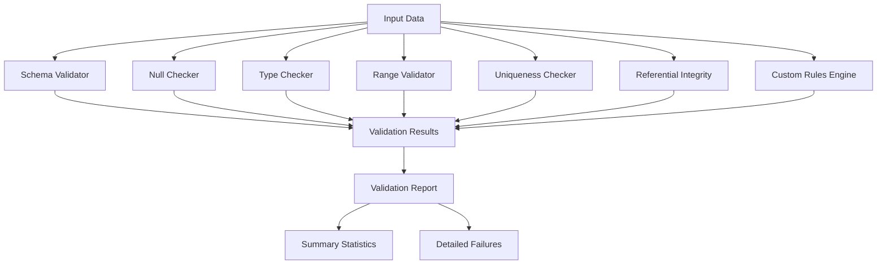
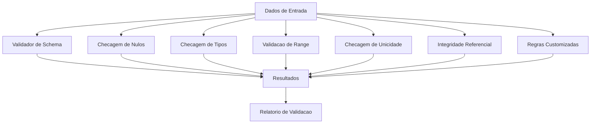

# Data Quality Validation Framework

<div align="center">


</div>

**[English](#english)** | **[Portugues (BR)](#portugues-br)**

---

## English

### Overview

A comprehensive data quality validation framework implementing schema validation, null checks, type checks, range validation, uniqueness checks, referential integrity verification, a custom rules engine, and validation reporting. Built in pure Python.

### Architecture


```mermaid
graph TD
    A[Input Data] --> B[Schema Validator]
    A --> C[Null Checker]
    A --> D[Type Checker]
    A --> E[Range Validator]
    A --> F[Uniqueness Checker]
    A --> G[Referential Integrity]
    A --> H[Custom Rules Engine]
    B --> I[Validation Results]
    C --> I
    D --> I
    E --> I
    F --> I
    G --> I
    H --> I
    I --> J[Validation Report]
    J --> K[Summary Statistics]
    J --> L[Detailed Failures]
```

### Features

- **Schema Validation**: Validate data against column definitions (type, required, min/max, pattern, allowed values)
- **Null Checks**: Detect missing or empty values with null rate statistics
- **Type Checks**: Verify column data types (int, float, str, bool)
- **Range Validation**: Ensure numeric values fall within expected bounds
- **Uniqueness Checks**: Detect duplicate values in key columns
- **Referential Integrity**: Verify foreign key relationships between datasets
- **Custom Rules Engine**: Define and apply arbitrary validation functions
- **Validation Reports**: Generate summary and detailed reports

### Usage

```python
from src.validators import SchemaValidator, NullChecker, ValidationReport

schema = {
    "id": {"type": "int", "required": True},
    "name": {"type": "str", "required": True},
    "age": {"type": "int", "min": 0, "max": 150},
    "email": {"pattern": r"^[\w.]+@[\w.]+\.\w+$"},
}

data = [{"id": 1, "name": "Alice", "age": 30, "email": "alice@example.com"}]

validator = SchemaValidator(schema)
results = validator.validate(data)
report = ValidationReport.generate(results)
print(ValidationReport.to_text(results))
```

### Running Tests

```bash
pytest tests/ -v
```

### Author

**Gabriel Demetrios Lafis** - [GitHub](https://github.com/galafis)

---

## Portugues BR

### Visao Geral

Um framework completo de validacao de qualidade de dados implementando validacao de schema, checagem de nulos, checagem de tipos, validacao de range, checagem de unicidade, verificacao de integridade referencial, motor de regras customizadas e relatorios de validacao.

### Arquitetura


```mermaid
graph TD
    A[Dados de Entrada] --> B[Validador de Schema]
    A --> C[Checagem de Nulos]
    A --> D[Checagem de Tipos]
    A --> E[Validacao de Range]
    A --> F[Checagem de Unicidade]
    A --> G[Integridade Referencial]
    A --> H[Regras Customizadas]
    B --> I[Resultados]
    C --> I
    D --> I
    E --> I
    F --> I
    G --> I
    H --> I
    I --> J[Relatorio de Validacao]
```

### Funcionalidades

- **Validacao de Schema**: Validar dados contra definicoes de colunas
- **Checagem de Nulos**: Detectar valores ausentes com estatisticas
- **Checagem de Tipos**: Verificar tipos de dados das colunas
- **Validacao de Range**: Garantir valores dentro de limites esperados
- **Unicidade**: Detectar valores duplicados
- **Integridade Referencial**: Verificar relacionamentos entre datasets
- **Regras Customizadas**: Motor para funcoes de validacao arbitrarias
- **Relatorios**: Gerar relatorios resumidos e detalhados

---

## License

MIT License - see [LICENSE](LICENSE) for details.
